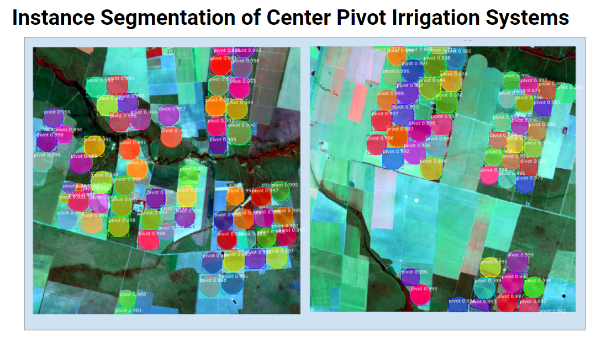
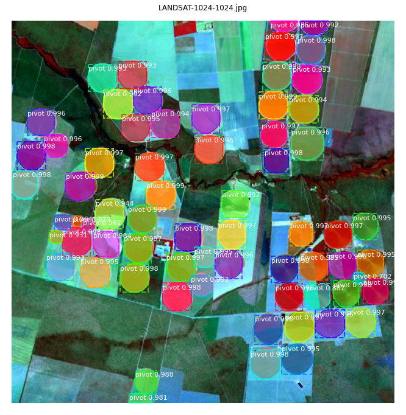
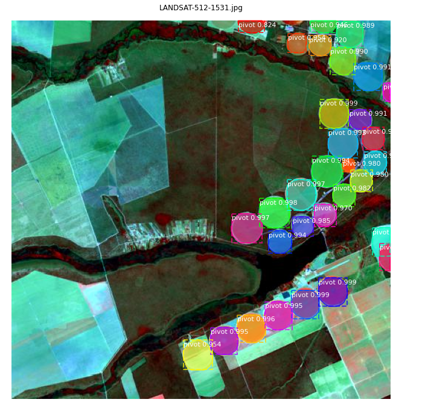
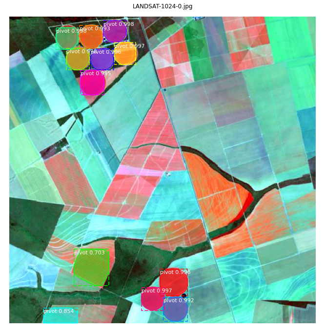
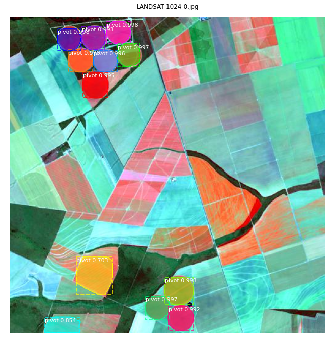
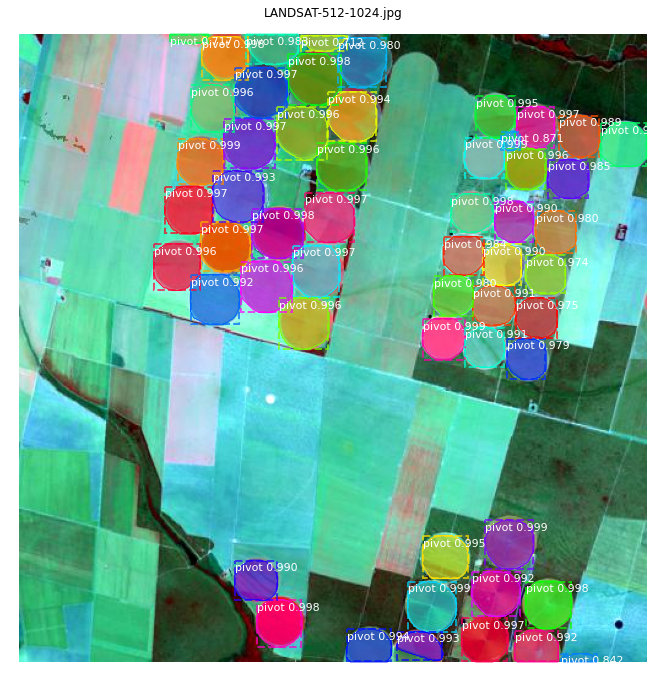

This is an implementation of instance segmentation of center pivot
 irrigation systems using Mask R-CNN on Python 3, Keras, TensorFlow and free
  Landsat images. 

The model generates bounding boxes and segmentation masks for each instance of 
an object in the image. It's based on Feature Pyramid Network (FPN) and a 
ResNet50 backbone.

#### Some results

 
This work is licensed under a <a rel="license" href="http://creativecommons.org/licenses/by-nc/4.0/">Creative Commons Attribution-NonCommercial 4.0 International License</a>.
